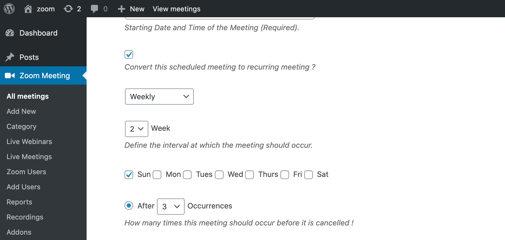
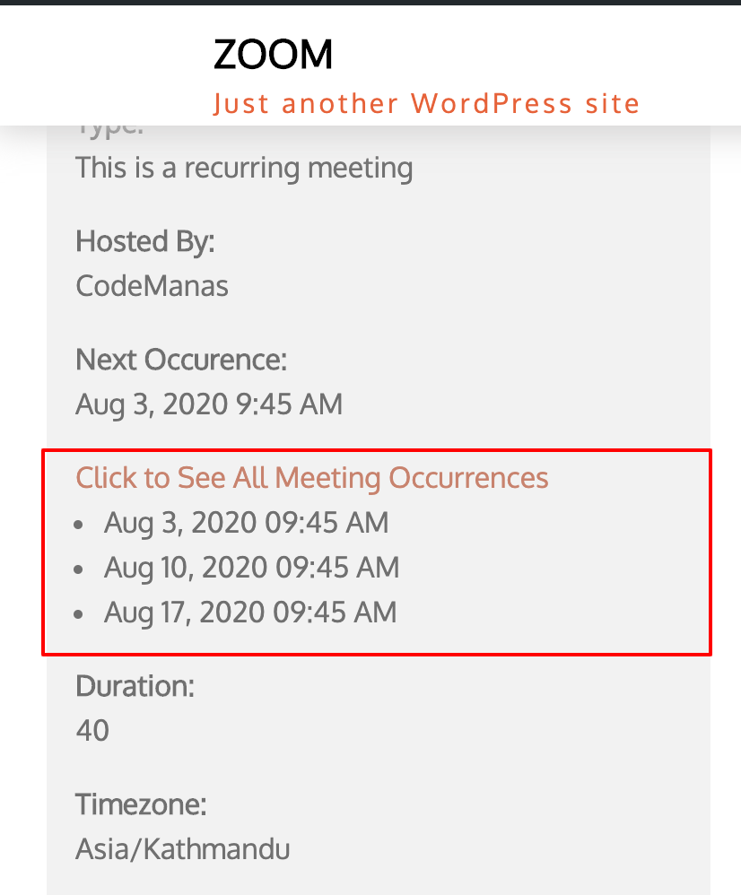
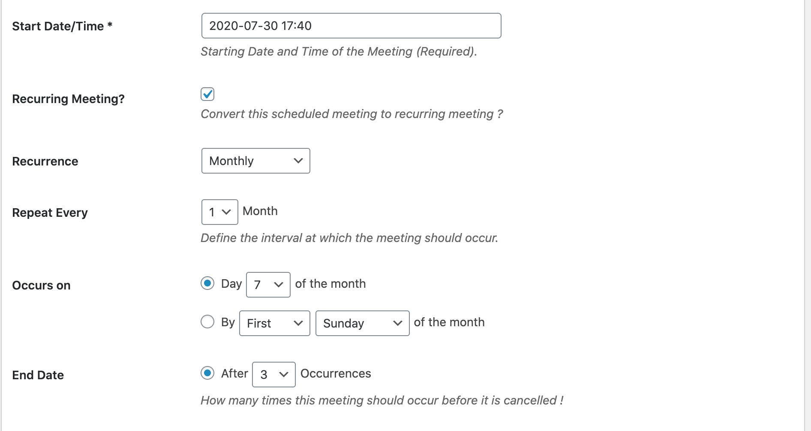
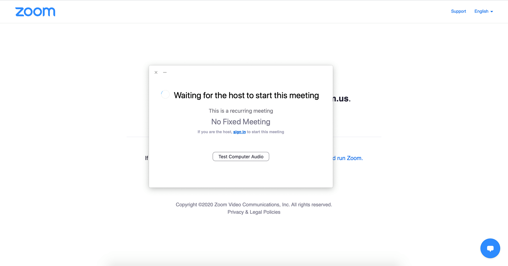
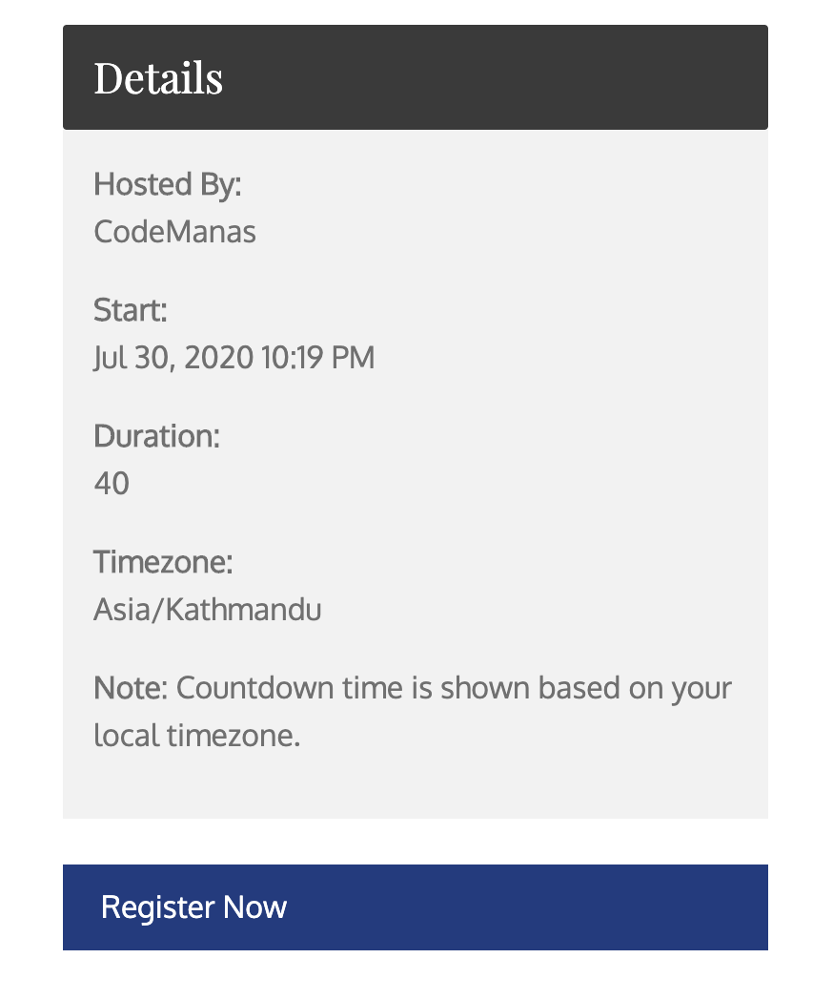
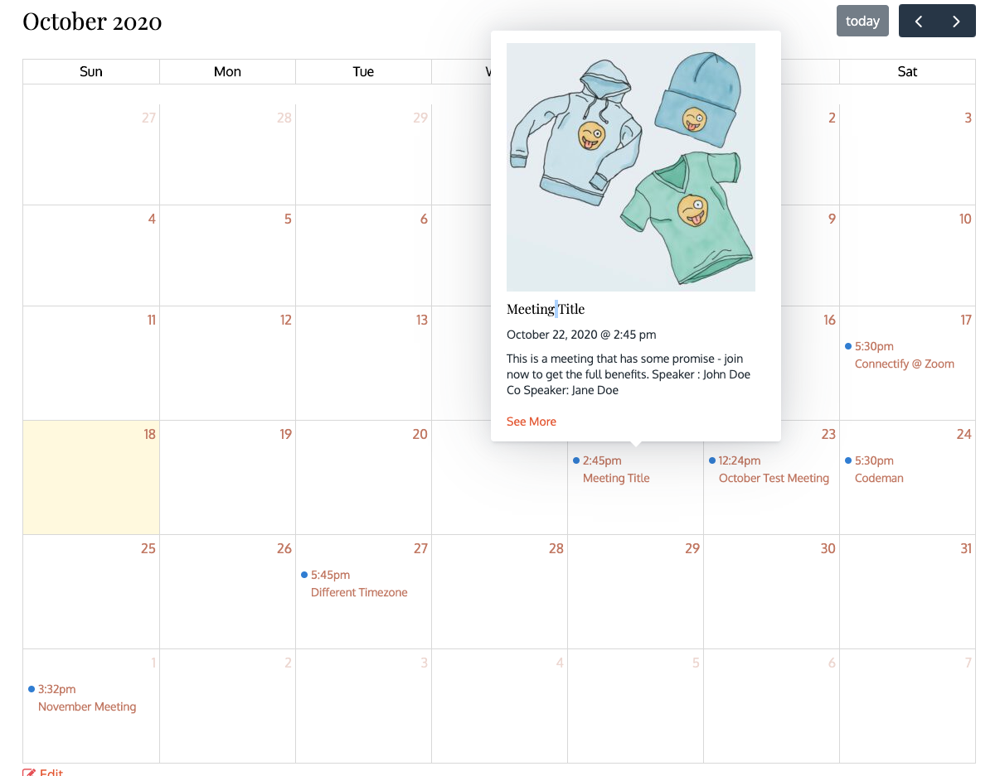
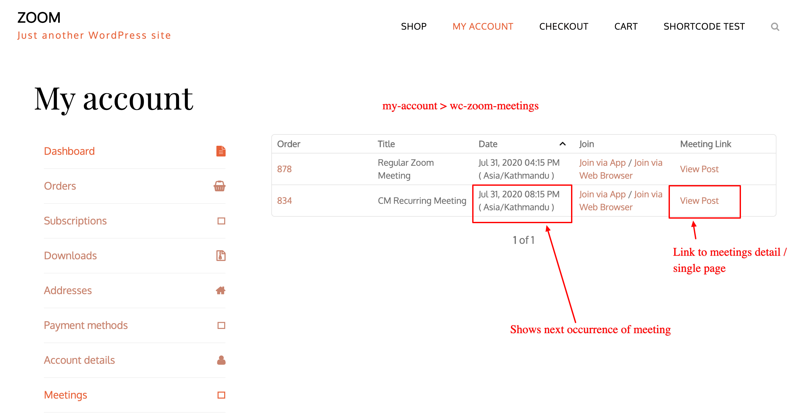

##Introduction
Provides:

* Recurring Meetings
* Registration
* Registration + Recurring Meetings
* Integration with WooCommerce (Pro Addon)

##PMI
Please refer to Zoom Documentation to learn a bit more :

[https://support.zoom.us/hc/en-us/articles/203276937-Using-Personal-Meeting-ID-PMI-](https://support.zoom.us/hc/en-us/articles/203276937-Using-Personal-Meeting-ID-PMI-)

---

;

---
     
Use Personal Meeting ID instead of an automatically generated meeting ID. It can only be used for scheduled meetings, instant meetings and recurring meetings with no fixed time.

## Recurring Meetings:

Recurring Meetings are meetings that can be set to repeat over a course of time.
We have provided the option of Occurrence to set the number of occurrences from 1 - 20 for a meeting.

Recurring Meetings can have a maximum of 20 occurrences

###Meeting Join Links:
A Zoom Meeting Join Link for any recurring meeting created via these methods will always be the same. That is meeting links will not change for each occurrence.

###How to set a recurring meeting:
Below we outline the various ways recurring meetings can be set

####Recurring Meeting Options
There are various options tp set a recurring Meeting:
    
1. [Daily](#daily)
2. [Weekly](#weekly)
3. [Monthly](#monthly)
4. [No Fixed Time](#no-fixed-time)

####Daily   
    

---

These meetings can be scheduled on a daily basis or with a time difference of once every 3 days - this allows the user to select a time range between 1 - 3 days.
An example can be if a user schedules a meeting for August 1 and keeps a gap of 3 days then the next occurrence of the meeting would be on August 4

####Weekly

Meetings can be scheduled per a weekly basis - you would need to select the day of the week and how many occurrences ( 1 - 20 ). The first occurrence will be the day of the week (sun - friday) according to the meeting start date selected  - the rest will follow suit. You can choose how frequently a meeting can be repeated i.e once every week or once every ( 2 - 12 ) weeks. 

For example if you select 
	Start Date: August 2, 2020 - 5:00PM as the start date
Occurrences: 3

	Day of the week: Sunday
	Repeat: Every 1 week
Then the dates for meeting will be:
	
	August 2, 2020 - Sunday
	August 9, 2020 - Sunday
	August 16, 2020 - Sunday
However, please note if you select July 29, 2020 as the start date i.e your selection is as follows:
	
	Start Date: July 29th, 2020 (Thursday)
	Day of the week: Sunday
	Occurrences: 3
	Repeat Every 1 week
Then the dates for the meetings will be same i.e:
	
	August 2, 2020 - Sunday
	August 9, 2020 - Sunday
	August 16, 2020 - Sunday
	

---

####Monthly
You can select -
Meeting Frequency / Repeat Every : ( 1 - 3 ) months

Occurs on: 

* Either: Day of month ( 1 - 31 )
* OR: [ First / Second / Third / Last ] [Day of week Sun - Fri ] of Month 

---

####No Fixed Time
This is for a always available meeting - this meeting will be always available for any user that has access to it.

Note: Meeting needs to be started by Host - otherwise user will be on standby,

##Registration
###Prerequisites:
To enable Registration on Meetings requires a paid Zoom plan [https://zoom.us/pricing](https://zoom.us/pricing) as of the writing of this document ( July 29th 2020 ) this means at least a Pro user account.

Excerpt taken from Zoom: [https://support.zoom.us/hc/en-us/articles/211579443-Registration-for-Meetings](https://support.zoom.us/hc/en-us/articles/211579443-Registration-for-Meetings)

>Scheduling a meeting that requires registration will allow participants to register with their e-mail, name, other questions, and custom questions. You can also generate meeting registration reports if you want to download a list of people that registered.

>Note: Participants joining meetings with registration, must use the Zoom desktop client or mobile app. They will not be able to join using the web client. “

One thing to Note is that Registered users will be required to login from their Zoom Apps - they will not be able to join via browser / web client.

###How to Enable Registration on a Meeting:

---
Registration can be enabled on a meeting by ticking the box marked “Registration”. This will enable unique join links for each user that has registered and the link will be sent via Zoom if not explicitly turned off. 

####Register Without Login:
This option dictates if a user needs to be logged into the site ( WordPress site ) to be able to register.

###Registration Flow 
Any user (visitor / customer) who visits the Meeting page will be shown a register now button
####Register Now - Call to Action

---
####Registration Form 
Once user clicks register now - they will be taken to the registration form page:

####Registration E-mail 
Once the registration form is filled - user will be registered to the meeting and if enabled setting ( Zoom Meetings > Settings > PRO ) user will receive a confirmation e-mail - this is optional as Zoom does send confirmation e-mail to registered user as well - but we have provided options to customize this e-mail.

Registration E-mail content can be change via the E-mail tab on ( Zoom Meetings > Settings > PRO )

Registration E-mail Sample:
    
   

##Calendar Widget
###Default Use
By using the shortcode [vczapi_zoom_calendar] - you can show a calendar that shows all meetings and webinars that are under "Zoom Meetings > All Meetings"

If a meeting is clicked - it will show you more of the events details.

Use: `[vczapi_zoom_calendar  author="" show="" calendar_default_view="dayGridMonth" show_calendar_views="yes"]`

Where,

* **class** = Ability to add custom css classes to modify design of calendar
* **author** = The user id of an Author, will show only the meetings/webinars of that particular author
* **show** = use "meeting" or "webinar" to either show only meetings or only webinars leave empty or do not use if you want to show all.
* **calendar_default_view** = options => dayGridMonth,timeGridWeek,timeGridDay,listWeek
* **show_calendar_views** = give ability to user to see calendar in different views - default value is "no", use "yes" to show other views

##Integration with WooCommerce (Pro Addon):
###Recurring Meetings + WooCommerce :
Simply create a [Zoom Recurring Meeting](#recurring-meetings) and then enable purchase of the product.
You can use follow the same steps as here : 
[https://zoom.codemanas.com/woocommerce/#1-product-linked-with-zoom-meeting](https://zoom.codemanas.com/woocommerce/#1-product-linked-with-zoom-meeting) or if you want a more visual representation please check out the video [https://www.youtube.com/watch?v=V6SfMFatOH8](https://www.youtube.com/watch?v=V6SfMFatOH8)

Once a recurring Product is Purchased - the customer if logged in will be able to view the meeting details on their my accounts > meetings [ https://examplle.com/my-account/wc-zoom-meetings/ ](https://examplle.com/my-account/wc-zoom-meetings/) 
Only the next occurrence of meeting will be shown here,
To see all occurrences you will need to go the meeting details page:

Meeting Detals on My Account Page :

---
Recurring Meeting Details :

### Meeting Registration + WooCommerce

Once a meeting has been created with registration enabled and linked with a WooCommerce product - the flow of registration slightly differs from basic registration. Users will not be directed to the registration - rather the WooCommerce checkout process will continue as normal.
The Billing Email Address and Billing First Name and Last Name used during the checkout process will be used to register the user to the meeting.

