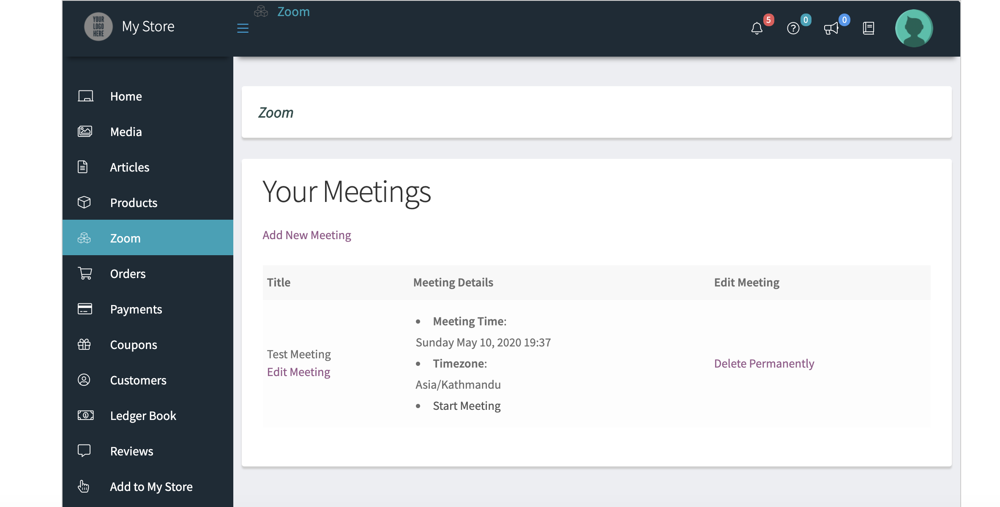
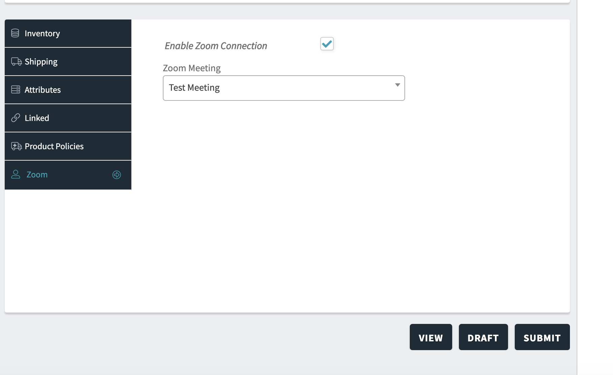

**This Addon is for WCFM – Frontend Manager for WooCommerce** you can get it [here](https://wordpress.org/plugins/wc-frontend-manager/).

##Prerequisite
1. Free version of [Video Conferencing with Zoom API ](https://wordpress.org/plugins/video-conferencing-with-zoom-api/)
2. WooCommerce [Download Here](https://wordpress.org/plugins/woocommerce/)
3. [WCFM – Frontend Manager for WooCommerce](https://wordpress.org/plugins/wc-frontend-manager/)
3. [Zoom integration for WooCommerce](https://www.codemanas.com/downloads/zoom-meetings-for-woocommerce/)
4. [Zoom Integration for WCFM](https://www.codemanas.com/downloads/wcfm-integration-for-zoom/)

##Introduction
Zoom Integration for WCFM acts as a glue plugin for Zoom integration for WooCommerce and WCFM.
This addon allows vendors to create and manage Zoom Meeting Products from the front end.

###Demo Video

<iframe width="560" height="315" src="https://www.youtube.com/embed/TExAQpPSxPU" frameborder="0" allow="accelerometer; autoplay; encrypted-media; gyroscope; picture-in-picture" allowfullscreen></iframe>

##Instructions

After successfully installing all the required plugins.
If you login as a vendor - you will be first shown a Zoom Meeting section on the WCFM dashboard.

1. Zoom Menu dashboard link
2. From this menu item vendors can create and mange Zoom Meetings. Vendors will oonly be able to see their own meetings. The vendors will only be able to see and attach meetings they create via their own dashboard. i.e they will not be able to see other users Meetings.
3. After meeting is created, the created meeting can be then attached to a product. Below screenshot show hot the Zoom option should be shown on the frontend. 
    

---

##In Development
Before purchase it should be noted that Zoom Integration for WCFM is currently only available for WooCommerce Integration and Bookings is not supported yet.