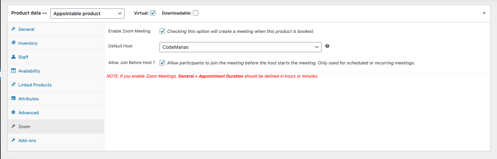
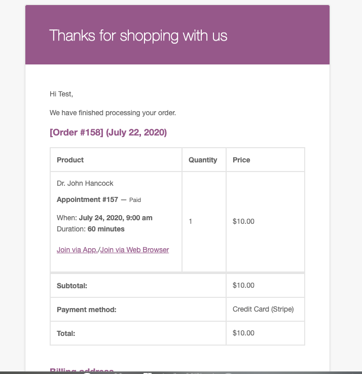

**This Addon is for WooCommerce Appoitments Plugin** it acts as an automation process in creating zoom meetings which is available [here](https://www.codemanas.com/downloads/zoom-for-woocommerce-appointments/).

## Prerequisite

1. Free version of [Video Conferencing with Zoom API ](https://wordpress.org/plugins/video-conferencing-with-zoom-api/)
2. WooCommerce [Download Here](https://wordpress.org/plugins/woocommerce/)
3. WooCommerce Appointments [Download Here](https://bookingwp.com/plugins/woocommerce-appointments/)

## Introduction

Zoom for WooCommerce Appointments allows you to automate your zoom meetings directly from your WordPress dashboard by linking zoom meetings to an appointment made via an appointable plugin using WooCommerce Appointments plugin. Users will receive join links in their Appointment confirmation emails. Admin can directly start meetings from wp-admin > Appointments list page.

### Demo Video of Implementation

<iframe width="560" height="315" src="https://www.youtube.com/embed/cw4uH4BPIH0" frameborder="0" allow="accelerometer; autoplay; encrypted-media; gyroscope; picture-in-picture" allowfullscreen></iframe>

Implementaion of the plugin video above.

## Features

Below are few features listed.

### Create Automated zoom meetings without configurations

With this plugin, your zoom meeting creation is automated. A zoom meeting is created once an Appointment is made from the customer side. It happens automatically with minimal configurations.

### Configure you Appointable Product

When you create an Appointable product, you will need to Enable Zoom Meeting and assign a host(if multiple hosts are available you can choose which one to assign).

---

---

### Join links and start links in email as well as your frontend my-account section.

After an Appointment is either confirmed or paid for (depending on the settings). Users will be able to join their Appointments from email link. Zoom meeting will be included in the Appointment email as well as inside the users my-account > appointments frontend table section.

---
My Accounts > Appointments

---

Order Complete Email

---

### Assign Staff Host ID
You can assing your staff with a host ID (if you have multiple Zoom Users under your account).
Once a Zoom User is assigned to a staff - all Appointments created with that host selected will create meetings using that user i.e. the meeting will come under their Zoom Meetings. (if you are still unclear please refer to our video above)
---

---